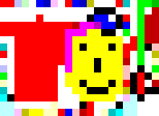
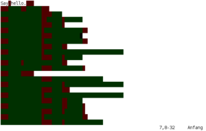

# CTF Candy

## Esoteric Languages (ESO Lang)
* https://esolangs.org/wiki/language_list

        Esoteric programming languages wiki!

* https://tio.run/

        "Tio is a online interpreters for an evergrowing list of practical and recreational programming languages."
### Examples of common esolangs

* [Brainfuck](https://www.dcode.fr/brainfuck-language)

        ```
        ++++++++++[>+>+++>+++++++>++++++++++<<<<-]>>>>.<---.>+++++++++++.-----------.+.<<++.>-.>+++++++++++++.-----------------.++++++++.+++++.--------.+++++++++++++++.------------------.++++++++.
        ```

* [Malbogne](http://www.malbolge.doleczek.pl/)

        ```(=<`#9]~6ZY32Vx/4Rs+0No-&Jk)"Fh}|Bcy?`=*z]Kw%oG4UUS0/@-ejc(:'8dc```

* [Piet](https://www.bertnase.de/npiet/npiet-execute.php)

    

* [JSFuck](http://codertab.com/JsUnFuck)

    [][(![]+[])[+[]]+([![]]+[][[]])[+!+[]+[+[]]]+(![]+[])[!+[]+!+[]]+(!![]+[])[+[]]+(!![]+[])[!+[]+!+[]+!+[]]+(!![]+[])[+!+[]]][([][(![]+[])[+[]]+([![]]+[][[]])[+!+[]+[+[]]]+(![]+[])[!+[]+!+[]]+(!![]+[])[+[]]+(!![]+[])[!+[]+!+[]+!+[]]+(!![]+[])[+!+[]]]+[])[!+[]+!+[]+!+[]]+(!![]+[][(![]+[])[+[]]+([![]]+[][[]])[+!+[]+[+[]]]+(![]+[])[!+[]+!+[]]+(!![]+[])[+[]]+(!![]+[])[!+[]+!+[]+!+[]]+(!![]+[])[+!+[]]])[+!+[]+[+[]]]+([][[]]+[])[+!+[]]+(![]+[])[!+[]+!+[]+!+[]]+(!![]+[])[+[]]+(!![]+[])[+!+[]]+([][[]]+[])[+[]]+([][(![]+[])[+[]]+([![]]+[][[]])[+!+[]+[+[]]]+(![]+[])[!+[]+!+[]]+(!![]+[])[+[]]+(!![]+[])[!+[]+!+[]+!+[]]+(!![]+[])[+!+[]]]+[])[!+[]+!+[]+!+[]]+(!![]+[])[+[]]+(!![]+[][(![]+[])[+[]]+([![]]+[][[]])[+!+[]+[+[]]]+(![]+[])[!+[]+!+[]]+(!![]+[])[+[]]+(!![]+[])[!+[]+!+[]+!+[]]+(!![]+[])[+!+[]]])[+!+[]+[+[]]]+(!![]+[])[+!+[]]]((![]+[])[+!+[]]+(![]+[])[!+[]+!+[]]+(!![]+[])[!+[]+!+[]+!+[]]+(!![]+[])[+!+[]]+(!![]+[])[+[]]+(![]+[][(![]+[])[+[]]+([![]]+[][[]])[+!+[]+[+[]]]+(![]+[])[!+[]+!+[]]+(!![]+[])[+[]]+(!![]+[])[!+[]+!+[]+!+[]]+(!![]+[])[+!+[]]])[!+[]+!+[]+[+[]]]+[+!+[]]+(!![]+[][(![]+[])[+[]]+([![]]+[][[]])[+!+[]+[+[]]]+(![]+[])[!+[]+!+[]]+(!![]+[])[+[]]+(!![]+[])[!+[]+!+[]+!+[]]+(!![]+[])[+!+[]]])[!+[]+!+[]+[+[]]])()

* [Whitespace](https://vii5ard.github.io/whitespace/)

    

* [Emojicode](https://www.emojicode.org/docs/guides/install.html)

        🏁 🍇
        😀 🔤Hey!🔤❗️
        🍉

* [Befunge-93](http://www.quirkster.com/iano/js/befunge.html)

        2>:3g" "-!v\  g30          <  |!`"O":+1_:.:03p>03g+:"O"`|  @               ^  p3\" ":<
* [Ook]()

        Ook. Ook? Ook. Ook. Ook. Ook. Ook. Ook. Ook. Ook. Ook. Ook. Ook. Ook. Ook. Ook.
        Ook. Ook. Ook. Ook. Ook! Ook? Ook? Ook. Ook.

    Could also be written without the Ook
        . ? . . . . . ! .

## Steganography

* stegsolve.jar

* Steghide

* StegCracker

* openstego

* zsteg

* jsteg

* jstego

* gimp

* photoshop

* zbarimg (QR Code)

        Usage: zbarimg image.png

### Audio Steganography

* [DTFM Tones](http://dialabc.com/sound/detect/index.html)

* SONIC Visualizer

* SSTV


### What to look out for

    * Anomalies
    * Repetitive patterns
    * Positive and negative numbers could be binary (0, 1).
    * Binary code could be morse code
    * Morse code
        - Also check for nonstandard delimiter


## PNG Forensics

* pngcheck

        pngcheck -vt7f image.png

* pngcsum

    If you have a corrupt png (CRC32 checksum for example) this tool can fix it without having to open a hexeditor.

        pngcsum broken.png new.png

* pngcrush

* pngchunks

        Usage: pngchunks chall.png

* pngfix

        Usage: pngfix chall.png


* pnginfo

        Usage: pnginfo chall.png

* pngsplit

        Usage:  pngsplit chall.png

#### The Animated Portable Network Graphics (APNG) file format

* [APNG Disassembler 2.9](http://apngdis.sourceforge.net)

        Usage: apngdis anim.png [name]

* [TweakPNG](http://entropymine.com/jason/tweakpng/)

    

        Usage: wine tweakpng.exe


# Cryptography

* Old phone keypad

    

* [Keyboard shift decoder](https://www.dcode.fr/keyboard-shift-cipher)

        gwkki -> hello (shift one key to the right)

* Bit shifted characters

        ord("A") = 65
        65 << 1 = 130 (encode)
        130 >> 1 = 65 (decode)

* Reverse text

        $ echo "dlrow olleh" | rev
        hello world
* [254caesar](https://github.com/flawwan/254caesar)

        echo -n "String to shift" | ./caesar

* [QuipQuip](https://quipqiup.com/)

        Sometimes you can get lucky with Quip and recover parts or even the complete flag.
        Tips:
        - Use CLUES
        - Try all modes

# Forensics

* strings

    Running strings on a binary can often reaval the flag. Use in conjunction with grep
        $ strings binary | grep "CTF_CHALL"
        $ strings binary | grep `echo -n "CTF_CHALL" | base64`


# Magic bytes

| Type        |  Recognize      | Signature  |
| ------------- |:-------------:| ----------:|
| EXE           |   MZ        |  4D 5A      |
| GIF           |   GIF87a        |  47 49 46 38 37 61|
| GIF           |   GIF89a        |  47 49 46 38 39 61      |
| JPG           |   ÿØÿà..JFIF..  |  FF D8 FF E0 00 10 4A 46 49 46 00 01       |
| PNG           |   .PNG....        | 89 50 4E 47 0D 0A 1A 0A      |
| PDF           |   %PDF-        |  25 50 44 46 2d     |
| 7z            |   7z¼¯'        |  37 7A BC AF 27 1C      |


Sources of inspiration:
* https://github.com/JohnHammond/ctf-katana/blob/master/README.md
* https://github.com/USCGA/tools
* https://ctftime.org/writeup/12243
* https://en.wikipedia.org/wiki/List_of_file_signatures
